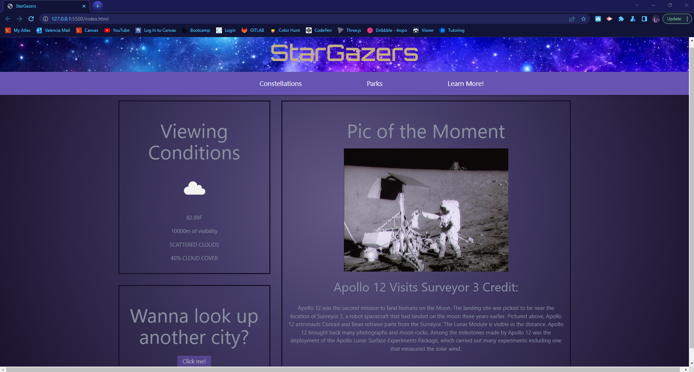
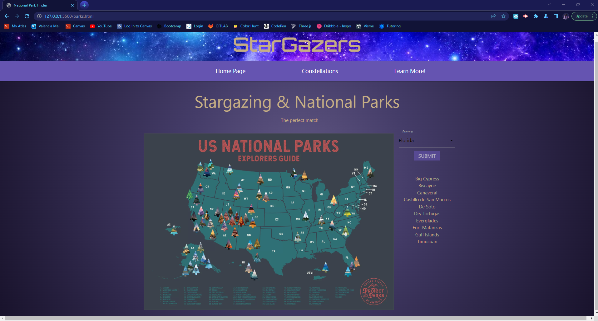
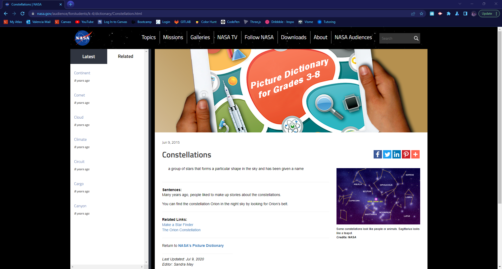

# StarGazers Website

## Description

Before covid, we took some our favorite outdoor pastimes for granted. During covid we sat around, our minds bored with seeing the same four walls each day while going through the motions.
And now that covid has passed? We’re in a weird inbetween state, where people want to go outside and enjoy nature, but don’t know how or where to even begin.

With our new Stargazers website, we hope to rekindle the flame of curiosity when it comes to outer space by giving you the user everything you need to get started. 

From how cold the night will be, to the enriching stories behind certain stars, and to the parks where you can relax and watch stars all night long. 
All of it will be available at your convenience through our website.

While working on this website, we ran through many issues, starting with Materialize. We had no idea how to work wiht Materialize as all we knew was Bootstrap,
since it was something new, everything we added with it was a challenege, from the modal, to the navbar, to the slider but with each challenege we surpassed our
expectations and made it even better! Another big challenge we had was the website you are reading this on, GitHub. We knew how to work with Github, but that was
individually, having to make pushes and pulls with multiple people uploading code was a challenge, but then as a team we learnt and adapted to it, now we're awesome at it.

## Usage

To use our website to its max potential, please enter the city you want to go stargazing in. Once the city is in, you can see the weather conditions for that day, 
so you'll know if it'll be a good day to look at the stars. You'll also notice the "Pic of the Moment" on the side, this feed comes staright from NASA!
This pic displayed will have the title and description along with it, so that you can know the story behind it and immerze yourself in its past.
Wanna look up another city? No problem, just click the button that says "Click me!" and it'll allow you to enter a different city to see the weather conditions there as well!

You'll notice that we also have a NavBar with multiple options, let's start with our "Constellations" tab.
If you liked reading the description of our "Pic of the Moment", please don't hesitate to go to our "Constellations" site.
You'll be able to find multiple constellations with their own original story, this will take you even further into how they came to be and what they represent.

Our next tab is "Parks". In this site, you'll be able to choose which state you'll be going stargazing and it's going to give you a list with multiple parks 
in the state you chose. Along with that list, if you want more information from the park to make an informed decision, just click on the parks name!
Each name has a link to the park's website, so that you can see all they offer and more detailed information about the park.

Lastly, we have the "Learn More!" tab. This tab is linked to the NASA constellations website, this will take you to see the detailed information NASA has to offer you!

Hope you enjoy the website!

## Credits

Credits primarily to our TA, JK! He's been a huge help through this process. Also, credits to the Materialize documents, even though confusing at times it was more than helpful.
And finally credits to our amazing team, We did such an amazing job and were able to work together through many challeneges. Together we achieved everything we wanted and more!
From being overachievers with a third API to amazing storytelling for our site to a stunning looking website! Good Job, everyone!!

## License

MIT License

## Links

Deployed site: 
